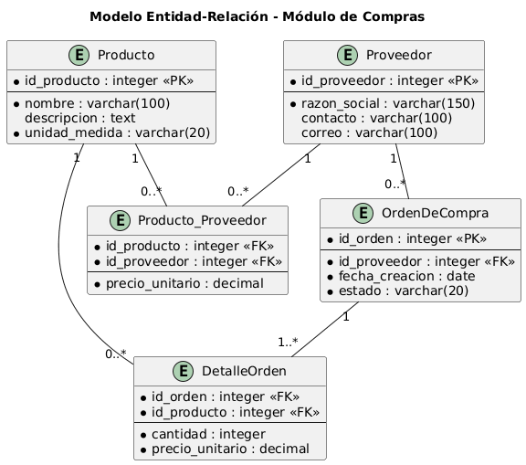
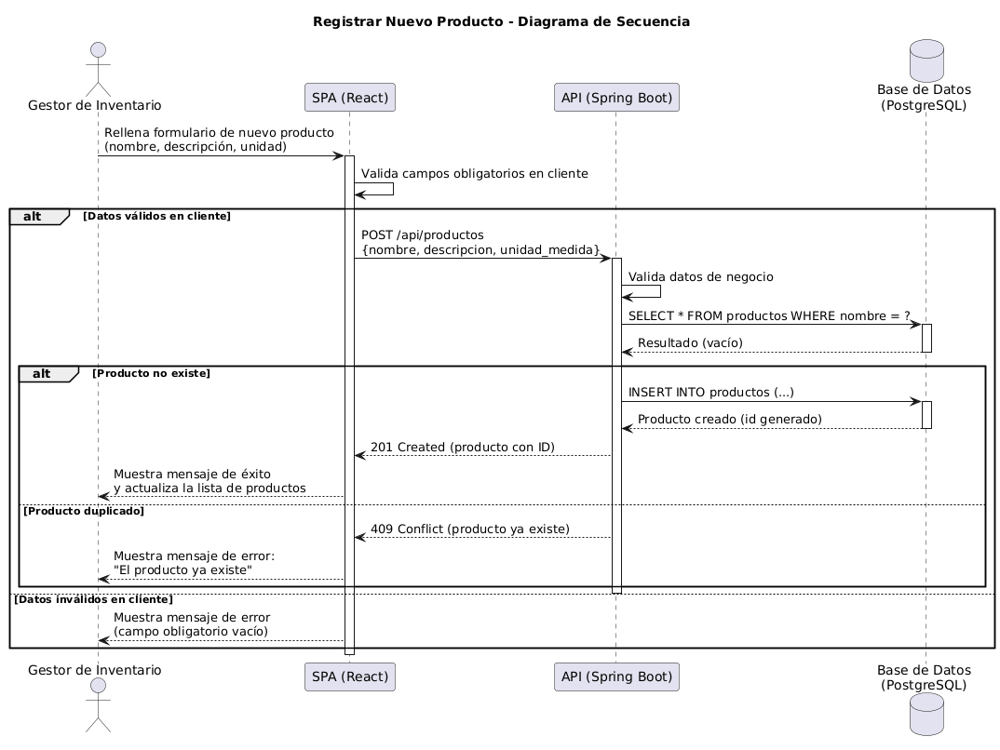

# 

**About arc42**

arc42, the template for documentation of software and system
architecture.

Template Version 9.0-EN. (based upon AsciiDoc version), July 2025

Created, maintained and © by Dr. Peter Hruschka, Dr. Gernot Starke and
contributors. See <https://arc42.org>.

# Introduction and Goals {#section-introduction-and-goals}

## Requirements Overview {#_requirements_overview}

El sistema ERP tiene como objetivo centralizar y automatizar los 
procesos administrativos y operativos de la empresa, integrando los 
módulos de Compras, Facturación, Stock/Costos, Activos Fijos, 
Empleados y EIS (Sistema de Información Ejecutiva).

Este documento se enfoca en el **Módulo de Compras**, cuyos requisitos 
de negocio principales son:

- Permitir el registro y mantenimiento de un catálogo de productos.
- Permitir el registro de proveedores y su información de contacto.
- Permitir la asociación de precios de un mismo producto a distintos 
  proveedores, para comparar ofertas.
- Permitir la generación de órdenes de compra formales hacia los 
  proveedores.
- Permitir la consulta y filtrado del catálogo de productos.

## Quality Goals {#_quality_goals}

| Prioridad |   Meta de Calidad   |                                  Motivación / Escenario                                                    |
|-----------|---------------------|------------------------------------------------------------------------------------------------------------|
|     1     |      Usabilidad     | El formulario de registro de productos debe validar datos en tiempo real, para reducir errores de captura. |
|     2     | Integridad de datos | El sistema no debe permitir productos duplicados ni datos numéricos inválidos en precios.                  |
|     3     |   Disponibilidad    | El módulo de compras debe estar disponible durante el horario laboral de la empresa.                       |

## Stakeholders

|      Role/Name       |     Contact        |                 Expectations                      |
|----------------------|--------------------|---------------------------------------------------|
| Gestor de Inventario | inventario@erp.com | Registrar y consultar productos de forma ágil     |
| Gestor de Compras    | compras@erp.com    | Registrar proveedores y generar órdenes de compra |
| Equipo de Desarrollo | dev@erp.com        | Contar con arquitectura clara y documentada       |

# Architecture Constraints {#section-architecture-constraints}

| Restricción | Explicación |
|---|---|
| Backend en Java con Spring Boot | Decisión tecnológica del equipo por experiencia previa y soporte de la comunidad. |
| Base de datos PostgreSQL | Motor relacional robusto y gratuito, adecuado para el modelo de datos del ERP. |
| Frontend como SPA con React | Se requiere una interfaz reactiva y desacoplada del backend. |
| Comunicación vía API REST (JSON) | Estándar para desacoplar frontend y backend. |
| Repositorio público en GitHub | Requisito académico del taller, facilita control de versiones. |
| Documentación en arc42 | Estándar solicitado para la documentación de arquitectura. |

# Context and Scope {#section-context-and-scope}

## Business Context {#_business_context}
El siguiente diagrama de contexto (C1) muestra el Sistema ERP como una 
caja negra, interactuando con el usuario Administrador de Compras y con 
el Sistema Contable Externo, al cual se le envían los datos de facturas 
y asientos contables generados por las compras.

## Technical Context {#_technical_context}

La comunicación entre los actores externos y el sistema se realiza 
mediante protocolo HTTPS. El envío de información al sistema contable 
externo se realiza a través de una integración vía API REST/JSON.

| Canal / Interfaz | Actor / Sistema | Tecnología | Formato de datos |
|---|---|---|---|
| Interfaz Web | Administrador de Compras ↔ SPA | HTTPS | HTML/JS (React) |
| API REST | SPA ↔ API Backend | HTTPS | JSON |
| Integración contable | API Backend ↔ Sistema Contable Externo | HTTPS (API REST) | JSON |
| Acceso a datos | API Backend ↔ Base de Datos | JDBC | SQL (PostgreSQL) |

- **Interfaz Web (SPA)**: el Administrador de Compras interactúa con el 
  sistema a través del navegador, consumiendo la aplicación React 
  servida como contenido estático.
- **API REST**: toda comunicación entre el frontend y el backend se 
  realiza mediante peticiones HTTP con cuerpos en formato JSON, 
  siguiendo el estilo arquitectónico REST.
- **Integración contable**: el envío de información hacia el Sistema 
  Contable Externo se realiza mediante llamadas API REST salientes, 
  disparadas cuando se generan órdenes de compra o eventos contables 
  relevantes.
- **Acceso a datos**: la API backend se conecta a la base de datos 
  PostgreSQL mediante el protocolo JDBC, siendo el único componente 
  con acceso directo a los datos.

**\<Mapping Input/Output to Channels\>**

| Canal | Tipo | Datos que transporta |
|---|---|---|
| SPA → API (POST /api/productos) | Entrada | Datos de nuevo producto (nombre, descripción, unidad) |
| SPA → API (POST /api/proveedores) | Entrada | Datos de nuevo proveedor |
| SPA → API (POST /api/ordenes-compra) | Entrada | Datos de orden de compra (productos, proveedor, cantidades) |
| API → SPA (respuestas REST) | Salida | Confirmaciones, errores de validación, listados |
| API → Sistema Contable Externo | Salida | Datos de facturas y asientos contables generados por las compras |

# Solution Strategy {#section-solution-strategy}

La estrategia de solución adoptada para el Módulo de Compras del 
sistema ERP se basa en las siguientes decisiones clave:

| Decisión | Justificación |
|---|---|
| Arquitectura monolítica simple (SPA + API + BD) | Adecuada al alcance académico del taller; evita la complejidad operativa de microservicios sin sacrificar separación de responsabilidades entre presentación, lógica de negocio y datos. |
| Frontend desacoplado (SPA en React) | Permite una experiencia de usuario reactiva y facilita la validación de datos en el cliente antes de llamar a la API, cumpliendo los criterios de aceptación de las historias de usuario. |
| Backend con API REST (Spring Boot) | Centraliza las reglas de negocio (ej. validación de productos duplicados) y expone servicios reutilizables por otros módulos del ERP en el futuro. |
| Base de datos relacional (PostgreSQL) | El dominio de Compras (productos, proveedores, órdenes) tiene relaciones estructuradas y consistentes, lo cual se modela naturalmente con un motor relacional. |
| Comunicación por HTTPS/JSON | Estándar de la industria, facilita la integración futura con el Sistema Contable Externo y con otros módulos del ERP (Facturación,Stock). |
| Documentación con C4 + arc42 | Permite documentar la arquitectura en distintos niveles de abstracción (contexto, contenedores) de forma clara y mantenible para el equipo. |

Esta estrategia prioriza la simplicidad y la trazabilidad entre 
requisitos (historias de usuario) y diseño técnico, siendo suficiente 
para el alcance actual del Módulo de Compras y extensible para 
incorporar los módulos restantes del ERP (Facturación, Stock/Costos, 
Activos Fijos, Empleados, EIS) en iteraciones futuras.

# Building Block View

## Whitebox Overall System

Motivation
:   Se optó por una arquitectura monolítica simple para el Módulo de 
    Compras, adecuada al alcance académico del taller y suficiente 
    para la carga esperada del sistema.

Contained Building Blocks
:   - **Single-Page Application (React)**: interfaz de usuario que 
      consume la API del backend.
    - **API Monolítica (Spring Boot)**: contiene toda la lógica de 
      negocio del módulo de compras (validaciones, reglas, 
      persistencia).
    - **Base de Datos (PostgreSQL)**: almacena productos, proveedores, 
      órdenes de compra y sus relaciones.

Important Interfaces
:   - SPA → API: HTTPS/JSON (REST)
    - API → Base de Datos: JDBC

### Single-Page Application (React)

*Purpose/Responsibility*: Renderizar formularios y listados, capturar 
la interacción del usuario y consumir la API REST del backend.

*Interface(s)*: Consume endpoints REST vía HTTPS/JSON.

*Fulfilled Requirements*: Historias de registro, consulta/filtrado de 
productos y creación de órdenes de compra.

### API Monolítica (Spring Boot)

*Purpose/Responsibility*: Exponer endpoints REST, validar reglas de 
negocio (ej. evitar productos duplicados, validar campos obligatorios) 
y coordinar el acceso a datos.

*Interface(s)*: Expone API REST (JSON) hacia la SPA; se conecta a la 
base de datos vía JDBC.

*Fulfilled Requirements*: Todas las historias de usuario del módulo 
de compras.

### Modelo de Datos (Módulo de Compras)

El siguiente modelo Entidad-Relación (MER) representa la estructura de 
datos que soporta el Módulo de Compras, incluyendo productos, 
proveedores, su relación de precios y las órdenes de compra.

Las entidades principales son:

- **Producto**: representa cada ítem del catálogo.
- **Proveedor**: representa a la entidad externa que suministra 
  productos.
- **Producto_Proveedor**: tabla intermedia que resuelve la relación 
  muchos-a-muchos entre productos y proveedores, incluyendo el precio 
  unitario ofrecido por cada proveedor.
- **OrdenDeCompra** y **DetalleOrden**: modelan la solicitud formal de 
  productos a un proveedor específico, con sus cantidades y precios 
  asociados en el momento de la compra.
  
### Base de Datos (PostgreSQL)

*Purpose/Responsibility*: Persistencia de las entidades Producto, 
Proveedor, Producto_Proveedor, OrdenDeCompra y DetalleOrden.

*Interface(s)*: Acceso vía JDBC desde la API.

## Level 2

*No se detalla un segundo nivel de descomposición interna de los 
contenedores, dado que el alcance del taller se limita al nivel de 
Contenedores (C2) de C4.*

# Runtime View

## Registrar un Producto

El siguiente escenario describe el flujo para la historia de usuario 
"Como gestor de inventario, quiero registrar nuevos productos...".

El gestor de inventario completa el formulario en la SPA, la cual 
valida los campos obligatorios antes de enviar la solicitud. La API 
recibe los datos, valida las reglas de negocio (incluyendo la 
verificación de duplicados) y, si son correctos, persiste el nuevo 
producto en la base de datos, devolviendo el registro creado con su 
identificador. Si el producto ya existe o los datos son inválidos, el 
sistema responde con un mensaje de error específico, cumpliendo los 
criterios de aceptación definidos para esta historia.

# Glossary

| Term | Definition |
|---|---|
| Producto | Ítem del catálogo que puede ser adquirido a uno o más proveedores. |
| Proveedor | Entidad externa que suministra productos a la empresa. |
| Orden de Compra | Documento formal que registra la solicitud de productos a un proveedor específico. |
| SPA | Single-Page Application, aplicación web que carga una única página HTML y actualiza contenido dinámicamente. |
| ERP | Enterprise Resource Planning, sistema que integra los procesos de negocio de una empresa. |